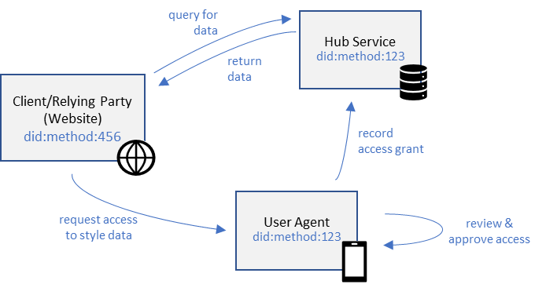
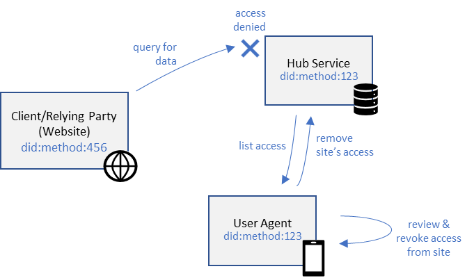

Identity Hub Permissions
================================
The success of a decentralized identity platform is dependent upon the ability for users to share their data with other people, organizations, apps, and services in a way that respects and protects a user’s privacy. In our decentralized platform, all user information & data resides in the user’s identity Hub. This document outlines the current proposal for identity hub authorizaiton.

## Scope of the current design
This proposal is a first cut. The intention is to start extremely simple, and extend the model to include more richness over time. We choose to focus on two simple use cases, described below.

### Use case 1: Registering for a website

>Alice has added some useful data about her wardrobe style to her Hub: her measurements from her tailor, and a list of her favorite clothing brands. When Alice goes to try out a new online clothing retailer, the retailer’s website allows her to set up an account using her DID. After signing in her DID, the retailer’s website is able to access Alice’s style data. Alice does not have to re-enter her sizes in the site, and the site can give her recommended options based on her brand preferences.



### Use case 2: Reviewing & managing access

> Alice learns that one of the websites she visited is making improper use of her personal data. She would like to immediately remove that website’s access to her Hub.



### Out of scope

These use cases, and the current Hub authorization system are not sufficient to consider identity Hubs ready for real world usage. It leaves out several features that have been discussed as being necessary for a minimally viable authorization layer, including[[3]](#):

**Features that control *what* is being granted:**

- How to grant a permission to a specific object by ID, rather than all objects of a certain type.
- How to grant a permission to a property of some object type, rather than the entire object.
- How to grant permission to an object type and all of the children object types in its respective schema.
- How to filter a permission to only:
  - objects created by a specific DID.
  - objects created in a certain time period.
  - objects larger than some byte size.
- How to grant a permission to a zero-knowledge proof of some object, rather than the entire object.
- How to grant permission to act as a delegate of a DID when interacting with other Hubs.

**Features that control *who* is being granted access:**

- How to grant a permission to all DIDs, and therefore make some data public.
- How to create a permission that explicitly denies a DID access to an object.

**Features that limit/expand *where or when* access is granted:**

- How to time-bound permissions, such that a permission expires automatically.
- How to grant permissions to an app on some devices, but not others.

**Features that control *why* access is granted:**

- How an app can specify why permission is being requested.
- How a user can specify why permission is being denied.
- How relying parties and trust providers are reviewed for trustworthiness and integrity.

**Features that are related to Hub authorization, but will be addressed at a later time:**

- How to request & send callbacks to notify apps of changes to data and permissions in a Hub[[4]](#).
- How to authorize the execution of services, or extensions, in a Hub.
- What format(s) the Hub uses for requests & responses.
- How to encrypt data in a Hub such that the Hub provider cannot access it.

Clearly, there is a large body of functionality that can be added to Hub authorization over time. This is why this initial document intentionally strives to be as simple as possible. We’ll incorporate these things into Hub authorization over time as we receive feedback from early adopters of Identity Hubs.

# Authorization Model

Access to data in Identity Hubs is controlled by a special object stored in Hubs called a `PermissionGrant`. The structure of a `PermissionGrant` is:

```json
{
  "owner": "did:example:12345", // the identity owner (granters)’s DID
  "grantee": "did:example:67890", // the grantee’s DID
  "context": "schemas.clothing.org", // the data schema context
  "type": "measurements", // the data type
  "allow": "-R--", // allows create, read, update, and delete
  ... // additional richness & specificity can be added in the future
}
```

## Granting permissions

When a hub owner grants a permission to another DID, they can do so by specifying the exact objects in the permission grant. When permissions span more than one data type, several PermissionGrant objects can be created. For each PermissionGrant, the following object should be written to the `Permissions` interface of the owner's Hub, typically via user agent:

```json
{
  "@context": "schema.identity.foundation/Hub/",
  "@type": "PermissionGrant",
  "owner": "did:example:12345",
  "grantee": "did:example:67890",
  "context": "schemas.clothing.org",
  "type": "measurements",
  "allow": "-R--"
}
```

Note that the Hub Permissions interface only supports the single PermissionGrant object type. The Hub should reject any requests to create objects of other types in the Permissions interface, barring future updates to the PermissionGrant model.

The response format, and any error conditions, should be consistent with all other requests to Hubs. Upon creation of this permission grant object in a user’s Hub, the permission will be propagated to all other Hub instances listed in the user’s DID document via the Hub’s standard sync & replication protocol. This will ensure that all Hub instances are up-to-date with all new permission grants in a timely manner.

## Checking permissions

The following describes the logic implemented by the Hub’s authorization layer when a request arrives.


1. Receive incoming request from client
2. Determine relevant schema, verb, and client from request
3. Query for all PermissionGrants that whose object_type matches the schema, for the given client DID
4. Check if any query results allow the verb in question
5. Return success/failed authorization check

Note that PermissionGrants do not understand or evaluate the structure of a given schema. For instance, if a user grants access to all “https://schema.org/game” objects, they **do not** implicitly grant access to all “https://schema.org/videogame” objects (which is a child of game in schema.org’s hierarchy).

## Reviewing & managing permissions

`PermissionGrant` objects can be created, read, modified, and deleted just like any other object in a hub. To revoke access to data, the Hub owner needs to simply modify an existing `PermissionGrant` or delete it entirely. Instructions for reading and writing data in Identity Hubs is available in the [explainer](../explainer.md).

## Requesting permissions

At this time, proposals for how to request access to data in an identity hub via a user agent are still being evaluated. In the future, we will update this document with details on how a client can request access from a user.
